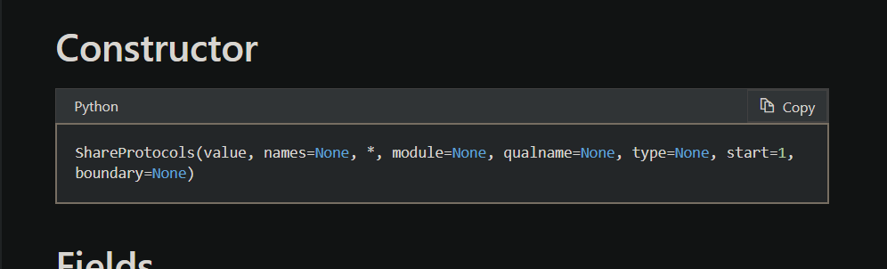
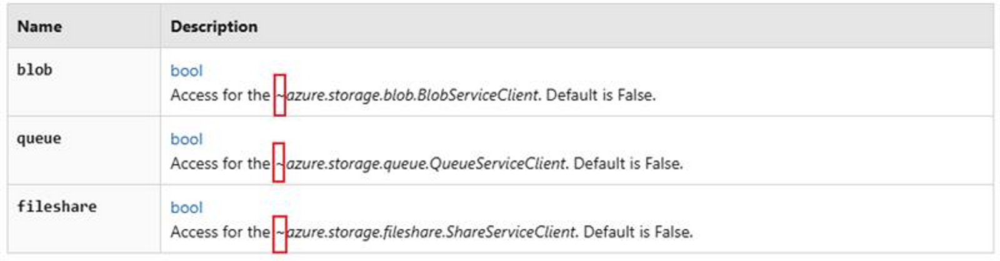
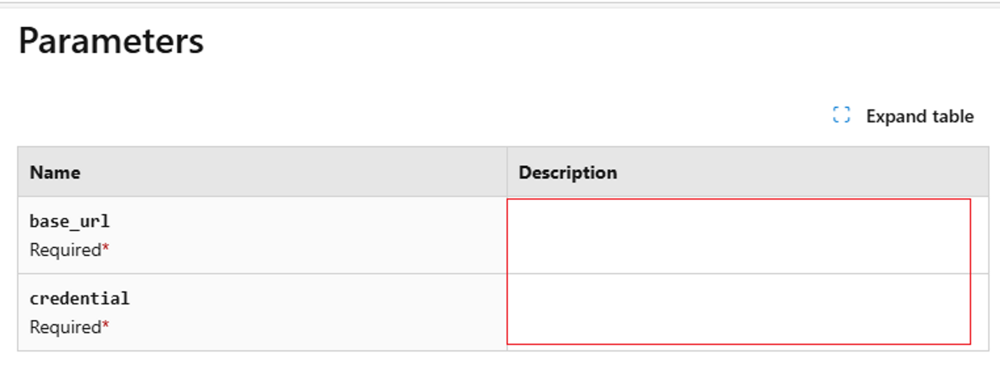
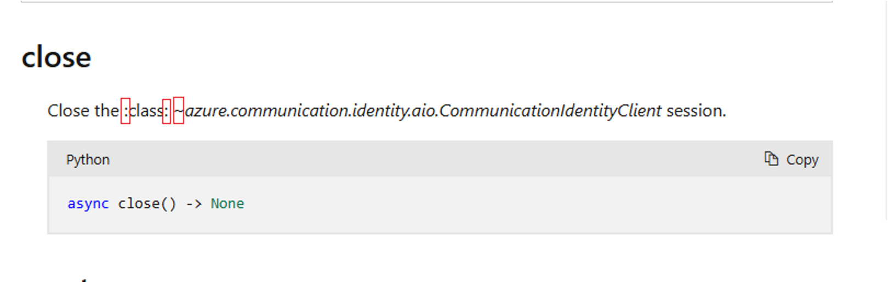

# Rules Introduction

## ExtraLabelValidation

1. This rule is to detect whether there are front-end tags in the page that are not parsed correctly.

2. Core code: 
```CSharp

        // Define a list (labelList) containing various HTML tags and entities.
        var labelList = new List<string> {
            "<br",
            "<span",
            "<div",
            "<table",
            "``<br /> If this is set to true for Windows based pools, WindowsConfiguration.enableAutomaticUpdates cannot be set to true.`
Link: https://learn.microsoft.com/en-us/python/api/azure-mgmt-batch/azure.mgmt.batch.models.automaticosupgradepolicy?view=azure-python#keyword-only-parameters


## TypeAnnotationValidation

1. Check each class and method parameter for correct type annotations and record any missing or incorrect ones.

2. Core code: 
```CSharp
    // If the parameter is "*" ,"/","**kwargs","*args","**kw", it indicates that no type annotation is required.
    // If the parameter follows the format a=b (e.g., param1=null), it means a default value has been assigned to the parameter.
    // If the parameter follows the format a:b (e.g., param1:int), it means a type annotation has been provided for the parameter.
    bool IsCorrectTypeAnnotation(string text)
    {
        if (text == "*" || text == "/" || text == "**kwargs" || text == "*args" || text == "**kw")
        {
            return true;
        }
        if (Regex.IsMatch(text, @"^[^=]+=[^=]+$"))
        {
            return true;
        }
        if (text.Contains(":"))
        {
            return true;
        }
        return false;
    }
```

3. Error sample:
Image:

Text : 
`ShareProtocols(value, names=None, *, module=None, qualname=None, type=None, start=1, boundary=None)`
Link: https://learn.microsoft.com/en-us/python/api/azure-storage-file-share/azure.storage.fileshare.shareprotocols?view=azure-python#constructor


## UnnecessarySymbolsValidation

1. Detect whether there are unnecessary symbols in page content.

2. Core code: 
```CSharp

    private void ValidateHtmlContent(string htmlContent)
    {
        // Usage: Find the text that include [ , ], < , >, &, ~, and /// symbols.
        string includePattern = @"[\[\]<>&~]|/{3}";

        // Usage: When the text contains symbols  < or >, exclude cases where they are used in a comparative context (e.g., a > b).
        string excludePattern1 = @"(?<=\w\s)[<>](?=\s\w)";

        string[] lines = htmlContent.Split(["\r\n", "\n"], StringSplitOptions.RemoveEmptyEntries);

        for (int index = 0; index < lines.Length; index++)
        {
            string line = lines[index];

            var matchCollections = Regex.Matches(line, includePattern);

            foreach (Match match in matchCollections)
            {
                if (match.Value.Equals("<") || match.Value.Equals(">"))
                {
                    if (Regex.IsMatch(line, excludePattern1))
                    {
                        continue;
                    }
                    // Usage: When the text contains <xref, this case will be categorized as an error of ExtraLabelValidation.
                    if (line.Contains("<xref"))
                    {
                        continue;
                    }
                    // Usage: When the text contains symbols => , -< , ->, exclude cases where they are used in a comparative context (e.g., a > b).
                    // Example: HTMLText - A list of stemming rules in the following format: "word => stem", for example: "ran => run".
                    // Link: https://learn.microsoft.com/en-us/python/api/azure-search-documents/azure.search.documents.indexes.models.stemmeroverridetokenfilter?view=azure-python#keyword-only-parameters
                    int i = match.Index - 1;
                    if (i >= 0 && (line[i] == '=' || line[i] == '-'))
                    {
                        continue;
                    }
                }

                if (match.Value.Equals("[") || match.Value.Equals("]"))
                {
                    if (line.Contains("<xref"))
                    {
                        continue;
                    }
                    if (IsBracketCorrect(line, match.Index))
                    {
                        continue;
                    }
                }

                string unnecessarySymbol = $"\"{match.Value}\""; ;
                valueSet.Add(unnecessarySymbol);
                errorList.Add($"Unnecessary symbol: {unnecessarySymbol} in text: {line}");
            }
        }
    }


```

3. Error sample:
Image:

Text : 
`Access for the ~azure.storage.blob.BlobServiceClient. Default is False.`
Link: https://learn.microsoft.com/en-us/python/api/azure-storage-file-share/azure.storage.fileshare.services?view=azure-python#keyword-only-parameters


## MissingContentValidation

1. Check if there is the blank table.

2. Core code: 
```CSharp

        // Fetch all th and td tags in the test page.
        var cellElements = await page.Locator("td,th").AllAsync();

        // Check if the cell is empty. If it is, retrieve the href attribute of the anchor tag above it for positioning.
        foreach (var cell in cellElements)
        {
            var cellText = (await cell.InnerTextAsync()).Trim();

            // Usage: Check if it is an empty cell and get the href attribute of the nearest <a> tag with a specific class name before it. Finally, group and format these errors by position and number of occurrences.
            // Example: The Description column of the Parameter table is Empty.
            // Link: https://learn.microsoft.com/en-us/python/api/azure-ai-textanalytics/azure.ai.textanalytics.aio.asyncanalyzeactionslropoller?view=azure-python
            if (string.IsNullOrEmpty(cellText))
            {
                // Fetch the first <a> href before the current cell.
                var aLocator = cell.Locator("xpath=//preceding::a[@class='anchor-link docon docon-link'][1]");
                var href = await aLocator.GetAttributeAsync("href");
                string anchorLink = "No anchor link found, need to manually search for empty cells on the page.";

                if (href != null)
                {
                    anchorLink = testLink + href;
                }

                errorList.Add(anchorLink);
            }
        }


```

3. Error sample:
Image:

Text : 
`Access for the ~azure.storage.blob.BlobServiceClient. Default is False.`
Link: https://learn.microsoft.com/en-us/python/api/azure-appconfiguration/azure.appconfiguration.aio.azureappconfigurationclient?view=azure-python#parameters


## GarbledTextValidation

1. Check whether there is garbled text.

2. Core code: 
```CSharp

        // Fetch all th and td tags in the test page.
        var cellElements = await page.Locator("td,th").AllAsync();

        // Check if the cell is empty. If it is, retrieve the href attribute of the anchor tag above it for positioning.
        foreach (var cell in cellElements)
        {
            var cellText = (await cell.InnerTextAsync()).Trim();

            // Usage: Check if it is an empty cell and get the href attribute of the nearest <a> tag with a specific class name before it. Finally, group and format these errors by position and number of occurrences.
            // Example: The Description column of the Parameter table is Empty.
            // Link: https://learn.microsoft.com/en-us/python/api/azure-ai-textanalytics/azure.ai.textanalytics.aio.asyncanalyzeactionslropoller?view=azure-python
            if (string.IsNullOrEmpty(cellText))
            {
                // Fetch the first <a> href before the current cell.
                var aLocator = cell.Locator("xpath=//preceding::a[@class='anchor-link docon docon-link'][1]");
                var href = await aLocator.GetAttributeAsync("href");
                string anchorLink = "No anchor link found, need to manually search for empty cells on the page.";

                if (href != null)
                {
                    anchorLink = testLink + href;
                }

                errorList.Add(anchorLink);
            }
        }


```

3. Error sample:
Image:

Text : 
`Access for the ~azure.storage.blob.BlobServiceClient. Default is False.`
Link: https://learn.microsoft.com/en-us/python/api/azure-communication-identity/azure.communication.identity.aio.communicationidentityclient?view=azure-python


## DuplicateServiceValidation

1. Check whether there is garbled text.

2. Core code: 
```CSharp

        // Fetch all th and td tags in the test page.
        var cellElements = await page.Locator("td,th").AllAsync();

        // Check if the cell is empty. If it is, retrieve the href attribute of the anchor tag above it for positioning.
        foreach (var cell in cellElements)
        {
            var cellText = (await cell.InnerTextAsync()).Trim();

            // Usage: Check if it is an empty cell and get the href attribute of the nearest <a> tag with a specific class name before it. Finally, group and format these errors by position and number of occurrences.
            // Example: The Description column of the Parameter table is Empty.
            // Link: https://learn.microsoft.com/en-us/python/api/azure-ai-textanalytics/azure.ai.textanalytics.aio.asyncanalyzeactionslropoller?view=azure-python
            if (string.IsNullOrEmpty(cellText))
            {
                // Fetch the first <a> href before the current cell.
                var aLocator = cell.Locator("xpath=//preceding::a[@class='anchor-link docon docon-link'][1]");
                var href = await aLocator.GetAttributeAsync("href");
                string anchorLink = "No anchor link found, need to manually search for empty cells on the page.";

                if (href != null)
                {
                    anchorLink = testLink + href;
                }

                errorList.Add(anchorLink);
            }
        }


```

3. Error sample:
Image:

Text : 
`Access for the ~azure.storage.blob.BlobServiceClient. Default is False.`
Link: https://learn.microsoft.com/en-us/python/api/azure-communication-identity/azure.communication.identity.aio.communicationidentityclient?view=azure-python