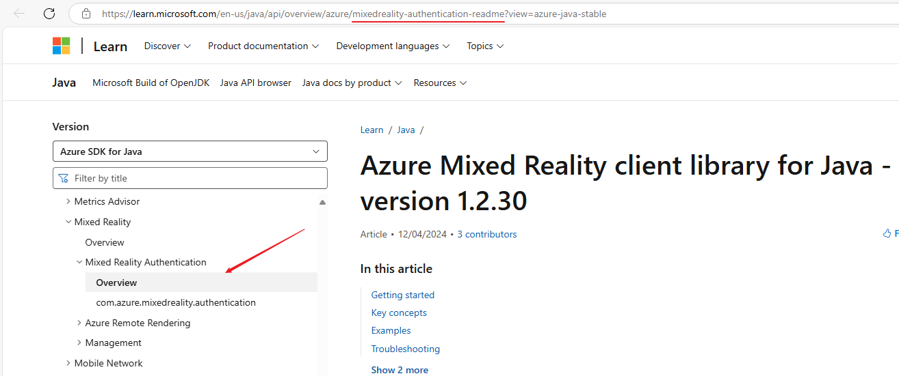
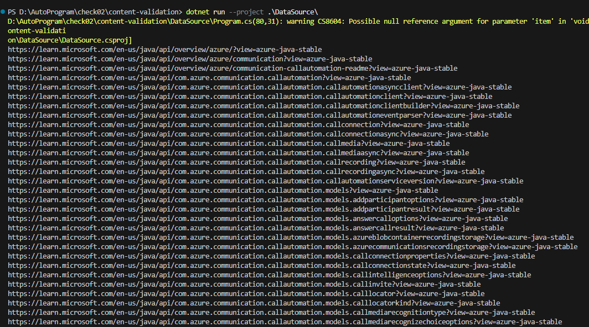

# DataSource

## Overview

Provide a brief description of the package and its purpose.

## Installation

Explain how to install the package. Include any prerequisites.

```bash
# Example installation command
dotnet restore
dotnet build
```

## Usage

### How To Get PackageName

- **Such as** : `loganalytics/client` `mixedreality-authentication-readme`
- **Image:**
  
- **Description:**
  You need to click into the corresponding package and find the packagename in the url between `/azure/` and `?view=azure-java-stable`
- **Test Result:**
  
