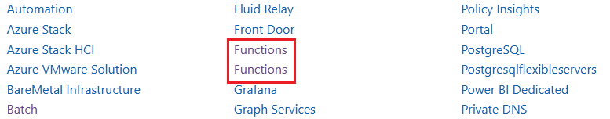

# Tool Rules Introduction For DotNet

## Overview

This document introduces 6 rules designed for DotNet Data SDK on [Microsoft Learn website](https://learn.microsoft.com/en-us/dotnet/api/overview/azure/?view=azure-dotnet) to complete automated content validation.

## Validation Rules

- [MissingContentValidation](#1-missingcontentvalidation)
- [EmptyTagsValidation](#2-emptytagsvalidation)
  > Note: Compared to Python rules, `EmptyTagsValidation` exists only in DotNet rules.
- [DuplicateServiceValidation](#3-duplicateservicevalidation)

### 1. MissingContentValidation

- **Goal:**
  This rule checks if there is the blank table.

- **Example:**

  - Link:
    https://learn.microsoft.com/en-us/dotnet/api/microsoft.rest.azure?view=azure-dotnet
  - Image:

    &nbsp;

- **Code Snippet:**

  ```csharp

    // Fetch all th and td tags in the test page.
    var cellElements = await page.Locator("td,th").AllAsync();

    // Flag for ignore method clear, copy, items, keys, values
    bool skipFlag = false;

    // Check if the cell is empty. If it is, retrieve the href attribute of the anchor tag above it for positioning.
    foreach (var cell in cellElements)
    {
        if (skipFlag)
        {
            skipFlag = false;
            continue;
        }

        var cellText = (await cell.InnerTextAsync()).Trim();

        // Skip cells that match the ignore list
        if (ignoreList.Any(item => cellText.Equals(item.IgnoreText, StringComparison.OrdinalIgnoreCase)))
        {
            skipFlag = true;
            continue;
        }

        // Usage: Check if it is an empty cell and get the href attribute of the nearest <a> tag with a specific class name before it. Finally, group and format these errors by position and number of occurrences.
        // Example: The Description column of the Parameter table is Empty.
        // Link: https://learn.microsoft.com/en-us/python/api/azure-ai-textanalytics/azure.ai.textanalytics.aio.asyncanalyzeactionslropoller?view=azure-python
        if (string.IsNullOrEmpty(cellText))
        {
            string anchorLink = "No anchor link found, need to manually search for empty cells on the page.";

            // Find the nearest heading text
            var nearestHTagText = await cell.EvaluateAsync<string?>(@"element => {
                function findNearestHeading(startNode) {
                    let currentNode = startNode;

                    while (currentNode && currentNode.tagName !== 'BODY' && currentNode.tagName !== 'HTML') {
                        let sibling = currentNode.previousElementSibling;
                        while (sibling) {
                            if (['H2', 'H3'].includes(sibling.tagName)) {
                                return sibling.textContent?.trim() || '';
                            }

                            let childHeading = findNearestHeadingInChildren(sibling);
                            if (childHeading) {
                                return childHeading;
                            }

                            sibling = sibling.previousElementSibling;
                        }
                        currentNode = currentNode.parentElement;
                    }
                    return null;
                }

                function findNearestHeadingInChildren(node) {
                    for (let child of node.children) {
                        if (['H2', 'H3'].includes(child.tagName)) {
                            return child.textContent?.trim() || '';
                        }
                        let grandChildHeading = findNearestHeadingInChildren(child);
                        if (grandChildHeading) {
                            return grandChildHeading;
                        }
                    }
                    return null;
                }

                return findNearestHeading(element);
            }");

            if (!string.IsNullOrEmpty(nearestHTagText))
            {
                nearestHTagText = nearestHTagText.Replace("\n", "").Replace("\t", "");

                if(ignoreList.Any(item => nearestHTagText.Equals(item.IgnoreText, StringComparison.OrdinalIgnoreCase)))
                {
                    continue; // Skip if the nearest heading text is in the ignore list
                }
                
                var aLocators = page.Locator("#side-doc-outline a");
                var aElements = await aLocators.ElementHandlesAsync();

                foreach (var elementHandle in aElements)
                {
                    var linkText = (await elementHandle.InnerTextAsync())?.Trim();
                    if (linkText == nearestHTagText)
                    {
                        var href = await elementHandle.GetAttributeAsync("href");
                        if (!string.IsNullOrEmpty(href))
                        {
                            anchorLink = testLink + href;
                            break; // Exit loop once the matching link is found
                        }
                    }
                }
            }

            // Add the anchor link to the error list if it doesn't match excluded patterns
            if (!anchorLink.Contains("#packages", StringComparison.OrdinalIgnoreCase) &&
                !anchorLink.Contains("#modules", StringComparison.OrdinalIgnoreCase))
            {
                errorList.Add(anchorLink);
            }
        }
    }


  ```


### 2. EmptyTagsValidation

- **Goal:**
  This rule checks whether there is Empty tags `<li></li>`.

- **Example:**
  - Link:
    https://learn.microsoft.com/en-us/dotnet/api/azure.ai.metricsadvisor.administration.datafeedsource?view=azure-dotnet
  - Image:

    &nbsp;

- **Code Snippet:**

  ```csharp

    // Get all <li> elements
    var liElements = page.Locator("main#main li").AllAsync();
    // int count = await liElements.CountAsync();
    
    foreach (var li in await liElements)
    {
        // Get and trim inner text
        var text = (await li.InnerTextAsync())?.Trim();
    
        if (text == "")
        {
            // Add to error list
            errorList.Add("<li></li>");
        }
    }
    
    
    if (errorList.Any())
    {
        var formattedList = errorList
            .GroupBy(item => item)
            .Select((group, index) => $"{index + 1}. Appears {group.Count()} times, {group.Key}")
            .ToList();
    
        res.Result = false;
        res.ErrorLink = testLink;
        res.NumberOfOccurrences = errorList.Count;
        res.ErrorInfo = "There are empty <li> tags on the page.";
        res.LocationsOfErrors = formattedList;
    }

  ```

### 3. DuplicateServiceValidation

- **Goal:**
  This rule checks whether there is duplicate service.

  > Note: In [DotNet doc](https://learn.microsoft.com/en-us/dotnet/api/overview/azure/?view=azure-dotnet), currently there is no such issue. The example from [Python doc](https://learn.microsoft.com/en-us/python/api/overview/azure/?view=azure-python), currently this issue have been fixed.

- **Example:**

  - Link:
    https://learn.microsoft.com/en-us/python/api/overview/azure/?view=azure-python
  - Image:

    &nbsp;

- **Code Snippet:**

  ```csharp

  //Get all service tags in the test page.
  var aElements = await page.Locator("li.has-three-text-columns-list-items.is-unstyled a[data-linktype='relative-path']").AllAsync();

  //Check if there are duplicate services.
  foreach (var element in aElements)
  {
      var text = await element.InnerTextAsync();

      //Store the names in the `HashSet`.
      //When `HashSet` returns false, duplicate service names are stored in another array.
      if (!set.Add(text))
      {
          errorList.Add(text);

          res.Result = false;
          res.ErrorLink = testLink;
          res.NumberOfOccurrences += 1;
      }

  }


  ```

