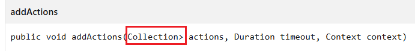
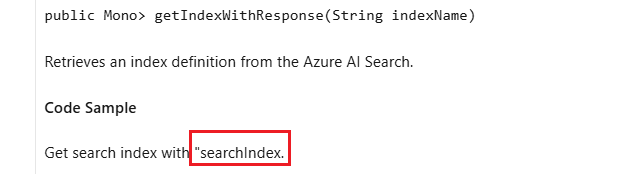

# Tool Rules Introduction For Java

## Overview

This document introduces 8 rules designed for Python Data SDK on [Microsoft Learn website](https://learn.microsoft.com/en-us/java/api/overview/azure/?view=azure-java-stable) to complete automated content validation.

## Validation Rules

- [ExtraLabelValidation](#1-extralabelvalidation)
- [UnnecessarySymbolsValidation](#2-unnecessarysymbolsvalidation)
- [MissingContentValidation](#3-missingcontentvalidation)
- [DuplicateServiceValidation](#4-duplicateservicevalidation)
- [InconsistentTextFormatValidation](#5-inconsistenttextformatvalidation)
- [CodeFormatValidation](#6-codeformatvalidation)

### 1. ExtraLabelValidation

- **Goal:**
  This rule detects whether there are front-end tags in the page that are not parsed correctly.

- **Extra Labels:**

  - `/p>` `<br` `<span` `<div` `<table` ` Notes: The Extra labels currently detected is `/p>`.

- **Example:**

  - Extra Label: `/p>`
  - Text Content:
    `The Azure AI Search service provides:/p> `
  - Link:
    https://learn.microsoft.com/en-us/java/api/com.azure.search.documents?view=azure-java-stable
  - Image:

    &nbsp;

- **Code Snippet:**

```csharp

        // Define a list (labelList) containing various HTML tags and entities.
        var labelList = new List<string> {
            "/p>",
            "<br",
            "<span",
            "<div",
            "<table",
            "` `~` `[` `]` `///`
    > Notes: Tes unnecessary symbol currently detected is `>`.

- **Example1:**

  - Unnecessary Symbols: `>`
  - Text Content:

    `public void addActions(Collection> actions)`

    `public Mono> createBlobContainerIfNotExistsWithResponse(String containerName, BlobContainerCreateOptions options)`

  - Link:
    https://learn.microsoft.com/en-us/java/api/com.azure.search.documents.searchindexingbufferedsender?view=azure-java-stable

    https://learn.microsoft.com/en-us/java/api/com.azure.storage.blob.blobserviceasyncclient?view=azure-java-stable

  - Image:

    &nbsp;
    &nbsp;

- **Example2:**

  - Text Error: `/**` & `-`

  - Text Content:

    `/** Creates of finds a KeyVaultRoleScope from its string representation.`

    `- If the deserialized XML object was missing any required properties.`

  - Link:
    https://learn.microsoft.com/en-us/java/api/com.azure.security.keyvault.administration.models.keyvaultrolescope?view=azure-java-stable#method-summary

    https://learn.microsoft.com/en-us/java/api/com.azure.storage.blob.models.blobcontaineritem?view=azure-java-stable#method-details

  - Image:

    &nbsp;
    &nbsp;

- **Example3:**

  - Link:

    https://learn.microsoft.com/en-us/java/api/com.azure.search.documents.indexes.searchindexasyncclient?view=azure-java-stable#method-details

    https://learn.microsoft.com/en-us/java/api/com.azure.messaging.servicebus.administration.models.sqlrulefilter?view=azure-java-stable#method-details

  - Image:

    &nbsp;
    &nbsp;

- **Code Snippet:**

```csharp

    private void ValidateHtmlContent(string htmlContent)
    {
        // Usage: Find the text that include [ , ], < , >, &, ~, and /// symbols.
        string includePattern = @"[\[\]<>&~]|/{3}";

        // Usage: When the text contains symbols  < or >, exclude cases where they are used in a comparative context (e.g., a > b).
        string excludePattern1 = @"(?<=\w\s)[<>](?=\s\w)";

        // Todo
        // Need to develop and design filtering specific rules for java content.
        // Currently in the design phase

        string[] lines = htmlContent.Split(["\r\n", "\n"], StringSplitOptions.RemoveEmptyEntries);

        for (int index = 0; index < lines.Length; index++)
        {
            string line = lines[index];

            var matchCollections = Regex.Matches(line, includePattern);

            foreach (Match match in matchCollections)
            {
                if (match.Value.Equals("<") || match.Value.Equals(">"))
                {
                    if (Regex.IsMatch(line, excludePattern1))
                    {
                        continue;
                    }
                    // Usage: When the text contains <xref, this case will be categorized as an error of ExtraLabelValidation.
                    if (line.Contains("<xref"))
                    {
                        continue;
                    }
                    // Usage: When the text contains symbols => , -< , ->, exclude cases where they are used in a comparative context (e.g., a > b).
                    // Example: HTMLText - A list of stemming rules in the following format: "word => stem", for example: "ran => run".
                    // Link: https://learn.microsoft.com/en-us/python/api/azure-search-documents/azure.search.documents.indexes.models.stemmeroverridetokenfilter?view=azure-python#keyword-only-parameters
                    int i = match.Index - 1;
                    if (i >= 0 && (line[i] == '=' || line[i] == '-'))
                    {
                        continue;
                    }
                }

                if (match.Value.Equals("[") || match.Value.Equals("]"))
                {
                    if (line.Contains("<xref"))
                    {
                        continue;
                    }
                    if (IsBracketCorrect(line, match.Index))
                    {
                        continue;
                    }
                }

                string unnecessarySymbol = $"\"{match.Value}\""; ;
                valueSet.Add(unnecessarySymbol);
                errorList.Add($"Unnecessary symbol: {unnecessarySymbol} in text: {line}");
            }
        }
    }


```

### 3. MissingContentValidation

- **Goal:**
  This rule checks if there is the blank table.

- **Example:**

  - Link:
    https://learn.microsoft.com/en-us/java/api/com.microsoft.azure.elasticdb.shard.schema.referencetableinfo?view=azure-java-stable#constructor-summary
  - Image:

    &nbsp;

- **Code Snippet:**

```csharp

        // Fetch all th and td tags in the test page.
        var cellElements = await page.Locator("td,th").AllAsync();

        // Check if the cell is empty. If it is, retrieve the href attribute of the anchor tag above it for positioning.
        foreach (var cell in cellElements)
        {
            var cellText = (await cell.InnerTextAsync()).Trim();

            // Usage: Check if it is an empty cell and get the href attribute of the nearest <a> tag with a specific class name before it. Finally, group and format these errors by position and number of occurrences.
            // Example: The Description column of the Parameter table is Empty.
            // Link: https://learn.microsoft.com/en-us/python/api/azure-ai-textanalytics/azure.ai.textanalytics.aio.asyncanalyzeactionslropoller?view=azure-python
            if (string.IsNullOrEmpty(cellText))
            {
                // Fetch the first <a> href before the current cell.
                var aLocator = cell.Locator("xpath=//preceding::a[@class='anchor-link docon docon-link'][1]");
                var href = await aLocator.GetAttributeAsync("href");
                string anchorLink = "No anchor link found, need to manually search for empty cells on the page.";

                if (href != null)
                {
                    anchorLink = testLink + href;
                }

                errorList.Add(anchorLink);
            }
        }


```

### 4. DuplicateServiceValidation

- **Goal:**
  This rule checks whether there is duplicate service.

  > Notes:In Java content,currently there is no such problem, example for python

- **Example:**

  - Link:
    https://learn.microsoft.com/en-us/python/api/overview/azure/?view=azure-python
  - Image:

    &nbsp;

- **Code Snippet:**

```csharp

        //Get all service tags in the test page.
        var aElements = await page.Locator("li.has-three-text-columns-list-items.is-unstyled a[data-linktype='relative-path']").AllAsync();

        //Check if there are duplicate services.
        foreach (var element in aElements)
        {
            var text = await element.InnerTextAsync();

            //Store the names in the `HashSet`.
            //When `HashSet` returns false, duplicate service names are stored in another array.
            if (!set.Add(text))
            {
                errorList.Add(text);

                res.Result = false;
                res.ErrorLink = testLink;
                res.NumberOfOccurrences += 1;
            }

        }


```

### 5. InconsistentTextFormatValidation

- **Goal:**
  Check that the inconsistent text is formatted correctly

- **Example:**

  - Link:
    https://learn.microsoft.com/en-us/java/api/com.azure.data.tables.models?view=azure-java-stable#classes
  - Image:

    &nbsp;

- **Code Snippet:**

```csharp

    //Todo

```

### 6. CodeFormatValidation

- **Goal:**
  Check if the code format is right.

- **Example:**

  - Link:

    https://learn.microsoft.com/en-us/java/api/com.azure.search.documents.searchclientbuilder?view=azure-java-stable

  - Image:

    &nbsp;

- **Code Snippet:**

```csharp

    //Todo

```
