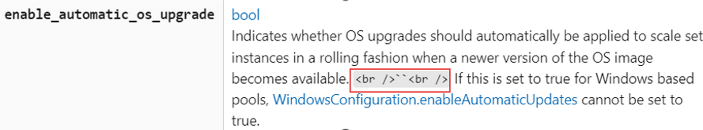
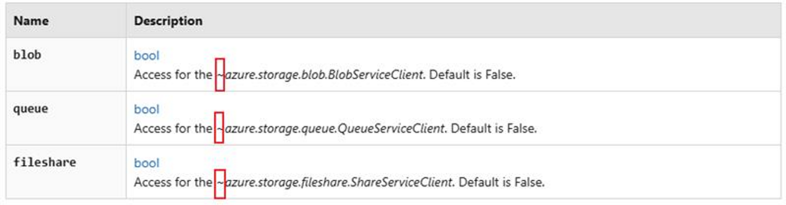
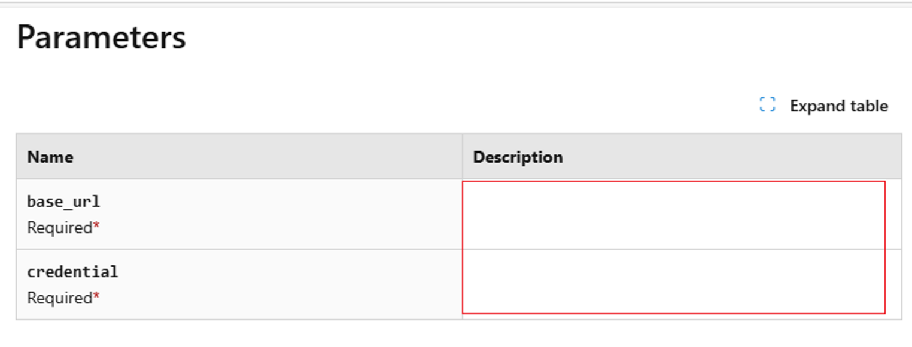
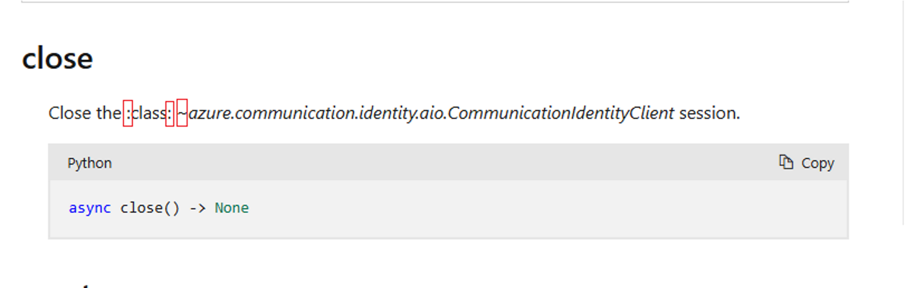

# Tool Rules Introduction For Python

## Overview
This document introduces 6 rules designed for Python Data SDK on [Microsoft Learn website](https://learn.microsoft.com/en-us/python/api/overview/azure/?view=azure-python) to complete automated content validation.

## Validation Rules
- [ExtraLabelValidation](#1-extralabelvalidation)
- [TypeAnnotationValidation](#2-typeannotationvalidation)
- [UnnecessarySymbolsValidation](#3-unnecessarysymbolsvalidation)
- [MissingContentValidation](#4-missingcontentvalidation)
- [GarbledTextValidation](#5-garbledtextvalidation)
- [DuplicateServiceValidation](#6-duplicateservicevalidation)
### 1. ExtraLabelValidation

- **Goal:**
This rule detects whether there are front-end tags in the page that are not parsed correctly.

- **Extra Labels:** 
    - `<br` , `<span` , `<div`, `<table` , ` Note : The extra labels currently detected are `<xref` , `<br` , `<code` , `&gt`.

- **Example:**
    - Extra Label: `<br />`
    - Text Content: 
    `Indicates whether OS upgrades should automatically be applied to scale set instances in a rolling fashion when a newer version of the OS image becomes available. <br />``<br /> If this is set to true for Windows based pools, WindowsConfiguration.enableAutomaticUpdates cannot be set to true.`
    - Link: 
    https://learn.microsoft.com/en-us/python/api/azure-mgmt-batch/azure.mgmt.batch.models.automaticosupgradepolicy?view=azure-python#keyword-only-parameters
    - Image:  
    &nbsp;

- **Code Snippet:**
  ```csharp 

        // Define a list (labelList) containing various HTML tags and entities.
        var labelList = new List<string> {
            "<br",
            "<span",
            "<div",
            "<table",
            "

- **Code Snippet:**
  ```csharp 
    // If the parameter is "*" ,"/","**kwargs","*args","**kw", it indicates that no type annotation is required.
    // If the parameter follows the format a=b (e.g., param1=null), it means a default value has been assigned to the parameter.
    // If the parameter follows the format a:b (e.g., param1:int), it means a type annotation has been provided for the parameter.
    bool IsCorrectTypeAnnotation(string text)
    {
        if (text == "*" || text == "/" || text == "**kwargs" || text == "*args" || text == "**kw")
        {
            return true;
        }
        if (Regex.IsMatch(text, @"^[^=]+=[^=]+$"))
        {
            return true;
        }
        if (text.Contains(":"))
        {
            return true;
        }
        return false;
    }
  ```


### 3. UnnecessarySymbolsValidation
- **Goal:**
This rule detects whether there are unnecessary symbols in page content.

- **Unnecessary Symbols:**  
    - `<` , `>` , `~` , `[` , `]` , `///`.

- **Example:**
    - Unnecessary Symbols: `~`
    - Text Content: 
    `Access for the ~azure.storage.blob.BlobServiceClient. Default is False.`
    - Link: 
    https://learn.microsoft.com/en-us/python/api/azure-storage-file-share/azure.storage.fileshare.services?view=azure-python#keyword-only-parameters
    - Image:  
    &nbsp;

- **Code Snippet:** 
  ```csharp 

    private void ValidateHtmlContent(string htmlContent)
    {
        // Usage: Find the text that include [ , ], < , >, &, ~, and /// symbols.
        string includePattern = @"[\[\]<>&~]|/{3}";

        // Usage: When the text contains symbols  < or >, exclude cases where they are used in a comparative context (e.g., a > b).
        string excludePattern1 = @"(?<=\w\s)[<>](?=\s\w)";

        string[] lines = htmlContent.Split(["\r\n", "\n"], StringSplitOptions.RemoveEmptyEntries);

        for (int index = 0; index < lines.Length; index++)
        {
            string line = lines[index];

            var matchCollections = Regex.Matches(line, includePattern);

            foreach (Match match in matchCollections)
            {
                if (match.Value.Equals("<") || match.Value.Equals(">"))
                {
                    if (Regex.IsMatch(line, excludePattern1))
                    {
                        continue;
                    }
                    // Usage: When the text contains <xref, this case will be categorized as an error of ExtraLabelValidation.
                    if (line.Contains("<xref"))
                    {
                        continue;
                    }
                    // Usage: When the text contains symbols => , -< , ->, exclude cases where they are used in a comparative context (e.g., a > b).
                    // Example: HTMLText - A list of stemming rules in the following format: "word => stem", for example: "ran => run".
                    // Link: https://learn.microsoft.com/en-us/python/api/azure-search-documents/azure.search.documents.indexes.models.stemmeroverridetokenfilter?view=azure-python#keyword-only-parameters
                    int i = match.Index - 1;
                    if (i >= 0 && (line[i] == '=' || line[i] == '-'))
                    {
                        continue;
                    }
                }

                if (match.Value.Equals("[") || match.Value.Equals("]"))
                {
                    if (line.Contains("<xref"))
                    {
                        continue;
                    }
                    if (IsBracketCorrect(line, match.Index))
                    {
                        continue;
                    }
                }

                string unnecessarySymbol = $"\"{match.Value}\""; ;
                valueSet.Add(unnecessarySymbol);
                errorList.Add($"Unnecessary symbol: {unnecessarySymbol} in text: {line}");
            }
        }
    }


  ```


### 4. MissingContentValidation

- **Goal:**
This rule checks if there is the blank table.

- **Example:**

    - Link: 
    https://learn.microsoft.com/en-us/python/api/azure-appconfiguration/azure.appconfiguration.aio.azureappconfigurationclient?view=azure-python#parameters
    - Image:  
    &nbsp;

- **Code Snippet:** 
  ```csharp 

        // Fetch all th and td tags in the test page.
        var cellElements = await page.Locator("td,th").AllAsync();

        // Check if the cell is empty. If it is, retrieve the href attribute of the anchor tag above it for positioning.
        foreach (var cell in cellElements)
        {
            var cellText = (await cell.InnerTextAsync()).Trim();

            // Usage: Check if it is an empty cell and get the href attribute of the nearest <a> tag with a specific class name before it. Finally, group and format these errors by position and number of occurrences.
            // Example: The Description column of the Parameter table is Empty.
            // Link: https://learn.microsoft.com/en-us/python/api/azure-ai-textanalytics/azure.ai.textanalytics.aio.asyncanalyzeactionslropoller?view=azure-python
            if (string.IsNullOrEmpty(cellText))
            {
                // Fetch the first <a> href before the current cell.
                var aLocator = cell.Locator("xpath=//preceding::a[@class='anchor-link docon docon-link'][1]");
                var href = await aLocator.GetAttributeAsync("href");
                string anchorLink = "No anchor link found, need to manually search for empty cells on the page.";

                if (href != null)
                {
                    anchorLink = testLink + href;
                }

                errorList.Add(anchorLink);
            }
        }


  ```


### 5. GarbledTextValidation

- **Goal:**
This rule checks whether there is garbled text.

- **Garbled Text:** 
    - `:xxxx:`
    - `:xxxx xxxx:`
    - `:xxxx xxxx xxxx:`

- **Example:**
    - Garbled Text: `:class:`
    - Text Content: 
    `Close the :class: ~azure.communication.identity.aio.CommunicationIdentityClient session.`
    - Link: 
    https://learn.microsoft.com/en-us/python/api/azure-communication-identity/azure.communication.identity.aio.communicationidentityclient?view=azure-python#methods
    - Image:  
    &nbsp;

- **Code Snippet:** 
  ```csharp 

        // Fetch all th and td tags in the test page.
        var cellElements = await page.Locator("td,th").AllAsync();

        // Check if the cell is empty. If it is, retrieve the href attribute of the anchor tag above it for positioning.
        foreach (var cell in cellElements)
        {
            var cellText = (await cell.InnerTextAsync()).Trim();

            // Usage: Check if it is an empty cell and get the href attribute of the nearest <a> tag with a specific class name before it. Finally, group and format these errors by position and number of occurrences.
            // Example: The Description column of the Parameter table is Empty.
            // Link: https://learn.microsoft.com/en-us/python/api/azure-ai-textanalytics/azure.ai.textanalytics.aio.asyncanalyzeactionslropoller?view=azure-python
            if (string.IsNullOrEmpty(cellText))
            {
                // Fetch the first <a> href before the current cell.
                var aLocator = cell.Locator("xpath=//preceding::a[@class='anchor-link docon docon-link'][1]");
                var href = await aLocator.GetAttributeAsync("href");
                string anchorLink = "No anchor link found, need to manually search for empty cells on the page.";

                if (href != null)
                {
                    anchorLink = testLink + href;
                }

                errorList.Add(anchorLink);
            }
        }


  ```


### 6. DuplicateServiceValidation

- **Goal:**
This rule checks whether there is duplicate service.

- **Example:**

    - Link: 
    https://learn.microsoft.com/en-us/python/api/overview/azure/?view=azure-python
    - Image:  
    &nbsp;


- **Code Snippet:** 
  ```csharp 

        //Get all service tags in the test page.
        var aElements = await page.Locator("li.has-three-text-columns-list-items.is-unstyled a[data-linktype='relative-path']").AllAsync();

        //Check if there are duplicate services.
        foreach (var element in aElements)
        {
            var text = await element.InnerTextAsync();

            //Store the names in the `HashSet`.
            //When `HashSet` returns false, duplicate service names are stored in another array.
            if (!set.Add(text))
            {
                errorList.Add(text);

                res.Result = false;
                res.ErrorLink = testLink;
                res.NumberOfOccurrences += 1;
            }

        }


  ```

